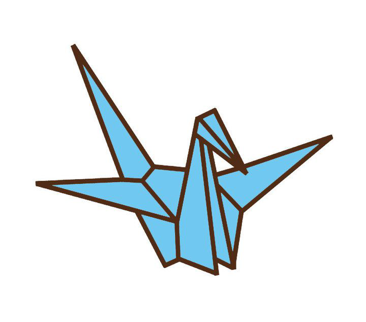

# You Got Craned !

Once upon a time, I was on a feature team named the `Paper Cranes`. And we decided to *feud* with another feature team.
We pranked each other a lot, and the best pranks were saved for Sprint Review. 

This project, however, is not for sprint review. Instead, each team had their own wall-mounted computer displaying a dashboard for their sprint standups, application health, and other performance monitoring. The dashboard was just the chrome web browser with a few tabs opened to Jira, newrelic, etc. 

To continue the feud with the other feature team, the cranes would put a picture of an origami paper crane on the other team's dashboard.  So we'd open up a tab to the picture of a paper crane. And whenever the other feature team returned from lunch or from their meeting, they would see the Paper Crane in their chrome tab. And they would close the tab and prank is over.

This project exists to automatic this prank's behavior. It will open a new chrome tab to a picture of a paper crane. It would check every so often that the tab is still open. If the tab was closed, then it will re-open it. If the tab is still there but in the background, then it will make that tab the active tab (bring it to the front).

## Future work

* Make the tab URL configurable
  * Make the tab URL determine from another site
* Make the watch interval configurable
